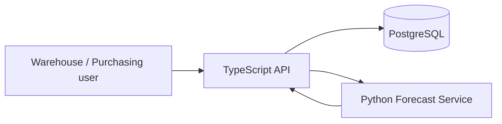

# 1. はじめに

前回の記事では、MUSUBIX3のCLI commandを一つずつ実行しながら、
TypeScript、Python、PostgreSQLによる在庫管理・需要予測platformを開発しました。

今回は条件を変えます。

**人間はMUSUBIX3のcommandを書きません。**

GitHub Copilot CLIへ自然言語の開発依頼を渡し、MUSUBIX3のSkill選択、
環境構築、仕様作成、実装、test、formal verification、Code Graph、
mutation、quality gateまでをCopilot自身に進めてもらいます。

ここでいう「自然言語プロンプトだけ」とは、Copilot CLIを開始する操作を除き、
人間が`npm install`、`musubix3 init`、`tdd red`、`trace build`、
`gate`などの個別commandを指示しない、という意味です。

ただし、「workflowの知識が不要」という意味ではありません。
今回のプロンプトはSkill名、quality check、完了条件を詳しく指定しています。
command-levelの操作を自然言語へ置き換えた実験であり、曖昧な目的だけを渡して
同じ結果へ到達できるかは検証していません。

実験は2026年9月8日に独立workspaceで行いました。
使用したMUSUBIX3は、公開済みのGitHub Copilot pluginと
npm package `musubix3@0.1.3`です。MUSUBIX3のlocal sourceは参照していません。
Copilot CLIは1.0.84-1、modelはGPT-5.6 Solを使用しました。

生成AIの出力は非決定的です。同じプロンプトでもfile数、設計、cycle数、
実行時間は一致しません。再現対象は、後述する制約とgateの判定方法です。

# 2. 結論

自然言語の初回プロンプトだけで、applicationの実装、native tests、
Docker Compose smoke、trace、Code Graph、Z3、mutationまでは到達しました。

ただし、最初の結果はfull gate失敗でした。

そこで、人間が個別commandや修正箇所を指定する代わりに、
失敗したquality checkと守るべき制約を自然言語で伝えました。
Copilotは同じsession内で証拠を再生成し、最終的に次の結果になりました。

| 項目 | 結果 |
|---|---:|
| 人間が入力したプロンプト | 2件 |
| requirements | 16 |
| design elements | 14 |
| ADR | 5 |
| workspace files | 106（dependencies / build / VCSを除外） |
| authoritative TEST IDs | 16 |
| native tests | TypeScript 13 + Python 3 = 16 pass |
| TDD | 再構成した18 Red-Green cycles / 0 validation errors（負のduration 19件、§11参照） |
| trace | 61 nodes / 122 edges / 0 diagnostics |
| trace coverage | design 100% / implementation 100% / test 100% |
| strict Code Graph | 13 files / 39 imports / 135 symbols / 394 calls |
| graph cycles / violations | 0 / 0 |
| formal coverage | 8/16 |
| Z3 | available / `sat` |
| Lean | unavailable |
| requirement-level mutation | 14/14 killed |
| performance | 2/2 budgets pass |
| model correspondence | 8/8 |
| workflow | 8 Skills / 8 verified invocations |
| staged changes | 2/2 complete |
| Docker Compose | build / health / readiness / forecast smoke pass |
| full gate | pass |
| full-workspace status | `ready=true` |
| changed gate | `POLICY_APPROVAL_REQUIRED`でfail |

つまり、**自然言語だけでもfull-workspaceの品質証拠まで作れました**。

一方で、commit禁止の実験条件だったため、変更workflow全体のreadyには
到達していません。`gate --changed`は、未commitのpolicy baselineに
独立承認がないことを正しく拒否しました。

# 3. 題材にしたapplication

開発対象は、倉庫業務向けの在庫管理・需要予測platformです。
production規模ではなく、主要な品質surfaceを一通り検証する小規模prototypeです。

| component | responsibility |
|---|---|
| TypeScript / Node.js | HTTP API、商品、在庫、引当、発注、監査 |
| Python | 移動平均、安全在庫、需要予測 |
| PostgreSQL | 在庫position、movement、reservation、purchase order |
| Docker Compose | API、forecast service、databaseの統合起動 |

主なbehaviorは次のとおりです。

- 倉庫別在庫を管理する
- 入出庫をidempotency keyで重複防止する
- 利用可能在庫を超える引当を拒否する
- 引当を解除する
- 発注を正しい状態順で遷移させる
- 需要履歴から移動平均と安全在庫を計算する
- supplier pack-size単位で補充量を切り上げる
- PostgreSQLとforecast serviceの状態をreadinessへ反映する
- 変更をaudit eventとして保存する
- operation counterでperformance budgetを検査する



# 4. 実験条件

Copilotへは、次の制約も自然言語で渡しました。

- 独立した新規workspaceだけで作業する
- MUSUBIX3のlocal repositoryを参照しない
- 公開pluginと`musubix3@0.1.3`だけを使う
- commit、push、releaseを行わない
- 8 Skillsを実際にinvokeする
- requirement、policy、thresholdを検査通過目的で弱めない
- proxy sourceや偽のtest reportを作らない
- test、Docker、Z3、mutationを実際に実行する
- missing toolや失敗を成功へ読み替えない
- secret、個人path、session IDを公開reportへ残さない

実験では非対話実行用の隔離workspaceを使用しました。
通常の利用では、Copilot CLIをinteractive modeで開始し、
file編集、shell、network accessを一つずつ確認する方が安全です。
credentialを含むrepositoryで無制限のtool permissionを与えるべきではありません。

# 5. 最初に入力した自然言語プロンプト

以下は、実験で使用したプロンプトからlocal pathだけを置き換えたものです。
applicationの目的、技術構成、品質条件に加えて、利用するSkillとcheckも
詳しく指定しています。MUSUBIX3の個別commandは含めていません。

```text
あなたは新しい独立workspaceで、MUSUBIX3を使った中規模の
在庫管理・需要予測platformを完成させる担当者です。

作業用のdirectoryを新規作成し、その中だけで作業してください。
親directoryにある他の実験成果やMUSUBIX3のlocal source codeは
参照・copyしないでください。

利用可能なのは、公開済みGitHub Copilot pluginのMUSUBIX3 v0.1.3と、
npm registryのmusubix3@0.1.3です。
git repositoryを初期化して構いませんが、commit、push、releaseはしないでください。

最初にsdd-change Skillを使い、必要に応じてsdd-requirements、
sdd-design、sdd-implementation、sdd-traceability、
sdd-formal-codegraph、sdd-knowledge、sdd-qualityを実際に使ってください。

TypeScriptとNode.jsによるHTTP API、Python需要予測service、
PostgreSQL、Docker Composeで構成してください。

商品、倉庫別在庫、冪等な入出庫、引当と解除、発注状態遷移、
需要履歴、移動平均予測、安全在庫、supplier pack-size単位の補充提案、
監査、dependency readinessを実装してください。

自然言語のこの依頼だけから、環境構築、MUSUBIX3初期化、
EARS形式の測定可能な要求、設計、ADR、Mermaid、実装、
native tests、Red-Green-Refactor、strict trace、strict Code Graph、
Z3、Lean availability確認、mutation、operation counterによるperformance、
model correspondence、workflow evidence、Docker Compose smoke、
full gate、changed gate、statusまで自律的に実施してください。

少なくとも12 requirements、同数程度のdesign elements、
TypeScriptとPythonを合わせて12件以上のauthoritative TEST ID、
代表的なmust機能のTDD evidenceを作ってください。

MUSUBIX3の検査を通すために要求、policy、thresholdを弱めたり、
proxy sourceや偽のtest resultを作ったりしないでください。
失敗やmissing toolは成功へ読み替えず、修正可能なものは修正して
再検証してください。

最後に、入力した自然言語プロンプト、実行した主要作業、各Skillの発火、
生成物数、test件数、trace coverage、graph metrics、formal結果、
TDD、mutation、performance、model correspondence、Docker、
gateとstatus、失敗と修正を構造化reportへ整理してください。

secret、JWT、個人path、session IDはreportへ保存しないでください。
完了した項目、未完了の項目、正確なblocker、主要測定値を報告してください。
```

# 6. Copilotが最初に行ったこと

Copilotは最初に`sdd-change`をinvokeし、その後7 Skillsも順次使いました。

| Skill | 実際に担当した内容 |
|---|---|
| `sdd-change` | application全体と後続変更の進行 |
| `sdd-requirements` | 16 requirementsとAcceptance |
| `sdd-design` | 14 design elements、5 ADR、Mermaid |
| `sdd-implementation` | TypeScript/Python/PostgreSQL/Docker実装 |
| `sdd-traceability` | annotation、trace build、coverage |
| `sdd-formal-codegraph` | Z3、Lean probe、strict graph |
| `sdd-knowledge` | local evidence indexとquery |
| `sdd-quality` | mutation、performance、gate、status |

人間は、どの順番でMUSUBIX3 CLIを実行するかを指定していません。
Skillに書かれたworkflowを読み、Copilotが必要なcommandを選択しました。

# 7. 自然言語から要求と設計が作られた

生成されたrequirementは16件です。

主なIDは次のように分離されました。

| area | requirement |
|---|---|
| product | 商品登録 |
| inventory | 入庫、出庫、負在庫防止、冪等性 |
| reservation | 引当、解除 |
| purchase order | 作成、提出、受領 |
| forecast | 移動平均、安全在庫、補充量 |
| operations | readiness、audit、performance |

初回の日本語EARS statementは、v0.1.3のcontrolled parserに一致しませんでした。
Copilotは意味を弱めず、parserが扱えるcontrolled Englishへ変更しました。

これは「日本語では仕様を書けない」という意味ではありません。
自然言語の説明は日本語のまま保持し、machine-readableなStatementだけを
対応するcontrolled syntaxへ寄せた、という分担です。

設計側では14 design elementsと5 ADRが作られました。
API、domain、PostgreSQL repository、forecast service、health/readiness、
mutation harness、performance reportの責務が分離されています。

# 8. 実装されたapplication

dependencies、build output、VCSを除いたworkspaceは106 filesでした。
strict Code Graphが解析したauthoritative TypeScript/Python graphは13 filesです。
主な構成は次のとおりです。

```text
src/
  inventory.ts
  http.ts
  postgres.ts
  server.ts
python/
  forecast_service.py
  tests/test_forecast.py
tests/
  inventory.test.ts
  http.test.ts
db/
  001_init.sql
Dockerfile.api
Dockerfile.forecast
docker-compose.yml
```

TypeScript側には10個の`CODE-INV-*` annotationがあり、
Python側を含めた16個の`TEST-INV-*`がrequirementへ接続されました。

最終native testは次の結果です。

| runner | result |
|---|---:|
| TypeScript | 13 passed |
| Python | 3 passed |
| total | 16 passed |

# 9. 初回プロンプトだけではfull gateに届かなかった

初回sessionでは、次の項目は成功しました。

- TypeScript/Python native tests
- Docker Compose buildと3 servicesのhealth
- API dependency readiness
- moving-average forecast smoke
- trace coverage 100%
- strict Code Graph cycle 0 / violation 0
- Z3 `sat`
- mutation 14/14 killed（test path mapping修正後）
- performance budgets pass
- model correspondence 8/8

しかし、full gateは失敗しました。

| failed check | 原因 |
|---|---|
| workflow | Skill declarationとCopilot transcriptが未照合 |
| tdd | 初期の失敗cycle、stale provenance、Python output再利用 |
| change-history | phase間fingerprintと順序が不完全 |
| change-completeness | 2 requirementsのAcceptanceがdetector上で不十分 |

重要なのは、Copilotがこれを「ほぼ成功」と丸めなかったことです。
構造化reportには`statusReady=false`と正確なblockerが残りました。

# 10. 2つ目の自然言語プロンプト

次に、人間が行ったのはMUSUBIX3 commandの手動実行ではありません。
同じCopilot sessionへ、失敗を直すための品質条件を追加しました。

```text
前回の実験を継続してください。
現在のfull gateはworkflow、tdd、change-history、
change-completenessで失敗しているため、まだ完了ではありません。

要求、policy、thresholdを弱めず、proxy sourceや偽test resultを作らずに、
自然言語のこの指示から修正と再検証を自律的に行ってください。

前回session自身のtranscriptを入力として扱い、secret、個人絶対path、
session IDを公開reportへ残さないsanitized copyをworkspace内へ作ってください。
実際の8 Skill lifecycleと各workflow declarationをstrictに照合してください。

TDDは既存のinvalidなappend-only evidenceを正当なmigration手順で
再生成してください。
全mandatory requirementについて、authoritative testを変更せず、
実際に対象実装を一時的に未実装または誤動作へ戻して
scoped failing Redを記録し、最小実装を復元して
fresh passing Greenを記録してください。

各test runnerは対象TEST IDだけのfresh structured reportを生成し、
stdoutとoutput evidenceもTEST IDごとに一意にしてください。
単にJSONを作るのではなく、必ずnative testを実行してください。

2つのCHANGEについて、実際に変更したnormative requirementだけを記載し、
impact、requirements、design、red、implementation、green、qualityの
順序とartifact fingerprintを正しく再記録してください。

Acceptance detectorが不足するrequirementは意味を弱めず、
明確な数量、status、HTTP code、時間上限など
machine-verifiableなAcceptanceへ改善してください。

修正後、native tests、strict trace、strict graph、Z3、mutation、
performance、model correspondence、Docker smoke、evidence refresh、
full gate、changed gate、statusを再実行してください。

commit禁止によりchanged gateのpolicy approvalだけが残る場合は、
full gateの結果と区別して報告してください。
他のcheckが残る場合は修正を続けてください。
```

# 11. TDD evidenceを再生成した方法

初回のgenerated reportでは、TDD evidenceに34 cycles、26 errorsが残っていました。
Copilotは成功した部分だけを拾って済ませず、TDD/order evidenceを
正式に再初期化しました。

その後、16 mandatory requirementsすべてについて次を行いました。

1. authoritative testを固定する
2. 対象実装を一時的に誤動作へ戻す
3. 対象testだけをnative runnerで実行する
4. failing Redを記録する
5. implementationを復元する
6. 同じtestでpassing Greenを記録する

`TEST-INV-006`と`TEST-INV-007`は、Acceptance強化後の最終test fingerprintに
対してcycleを追加したため、最終結果は18 cyclesになりました。

これは、test-firstで実装を始めた18 cyclesではありません。
すでに動作する実装を一時的に壊してRedを再現し、Greenへ戻した
**事後再構成のRed-Green evidence**です。

| TDD evidence | result |
|---|---:|
| cycles | 18 |
| valid Red | 18 |
| valid Green | 18 |
| hash-chain records | 36 |
| validation errors | 0 |

ただし、v0.1.3には実行時間計測の既知のvalidation gapがあります。
今回のTDD evidenceにも、wall clock後退による負の`durationMs`が19 records
残りました。v0.1.3はdurationの非負性を検査しないため、TDD check自体はpassします。

この問題は今回より前の実験でも発見され、MUSUBIX3 repositoryの
Unreleased変更ではmonotonic clockと`TDD_DURATION_INVALID`検査を追加済みです。
したがって、この記事のTDD passは**v0.1.3の判定結果**であり、
負のdurationを正常値として扱ってよいという意味ではありません。

# 12. 2つの変更workflow

自然言語の修正指示から、Copilotは2つのstaged changeを再構築しました。

| change | requirements | 目的 |
|---|---|---|
| `CHANGE-0001` | `REQ-INV-006`, `REQ-INV-007` | 発注状態とAcceptanceの強化 |
| `CHANGE-0002` | `REQ-INV-009`, `REQ-INV-010` | forecastと補充量のformal constraint |

各changeには次の7 phasesが記録されています。

```text
impact
requirements
design
red
implementation
green
quality
```

最終結果は次のとおりです。

| check | result |
|---|---:|
| changes | 2 |
| complete | 2 |
| history errors | 0 |
| completeness errors | 0 |

# 13. Traceability

最終traceは61 nodes、122 edgesでした。

| coverage | result |
|---|---:|
| requirement → design | 100% |
| requirement/design → implementation | 100% |
| requirement → test | 100% |
| diagnostics | 0 |

Copilotはsourceとtestへ`CODE-*`、`TEST-*`、`@implements`、
`@design`、`@verifies`を配置し、annotationからtraceを再生成しました。

ここで100%が意味するのは、定義された必須requirementに対して
必要なlinkが存在し、MUSUBIX3のvalidationを通過したことです。
business requirement自体が完全であることや、実装にbugがないことまでを
数学的に保証する数字ではありません。

# 14. Strict Code Graph

strict Code Graphの結果です。

| metric | value |
|---|---:|
| files | 13 |
| imports | 39 |
| symbols | 135 |
| calls | 394 |
| cycles | 0 |
| architecture violations | 0 |

初回はperformance probeがbuild後の`dist`をimportし、
authoritative source graphとの境界違反になりました。
Copilotは検査をcompatible modeへ弱めず、probeをTypeScript source importへ
変更してstrict modeを維持しました。

# 15. Z3とLean

16 requirementsのうち8件がformal modelへ入りました。

| item | result |
|---|---|
| modeled | 8/16 = 50% |
| consistency | consistent |
| Z3 | available / `sat` |
| Lean | `lean` / `lake` missing |
| unsupported | 8 warnings |

Z3の`sat`は、抽象化されたBoolean、numeric、transition constraintが
互いに矛盾していないことを示します。
application実装全体の正しさを示すものではありません。

Leanは環境に導入されていなかったため、成功とは記録していません。

# 16. Mutation testing

MUSUBIX3はmutation engine自体を同梱しないため、
Copilotはproject-local mutation harnessを作りました。

16 mandatory requirementsのうち14件がmust-functional、
残り2件がperformance requirementです。
14 must-functional requirementsに対応するsourceを1か所ずつ一時変更し、
対応するnative testが失敗することを確認して元へ戻しています。

| mutation | result |
|---|---:|
| requirements | 14 |
| mutants | 14 |
| killed | 14 |
| survived | 0 |
| errors | 0 |

初回はtest path mappingが誤っていましたが、Copilotはmappingを修正して
14/14を再実行しました。

これはagentが作成したproject-local harnessによるrequirement-levelの
sanity mutationです。Strykerやmutmutで多数のmutantを生成した
一般的なmutation scoreとは同一視できません。

# 17. Performance budget

elapsed timeだけではmachine loadの影響を受けるため、
performance requirementはoperation counterで定義されました。

| requirement | counter | observed | maximum |
|---|---|---:|---:|
| `REQ-INV-015` | `repositoryReads` | 1 | 2 |
| `REQ-INV-016` | `historyScans` | 1 | 1 |

2 budgetsともpassし、provenance errorは0でした。

# 18. Model correspondence

明示的なformal constraintを持つ8 requirementsについて、
formal model、trace、fresh passing test reportの対応を検査しました。

| metric | result |
|---|---:|
| formal requirements | 8 |
| covered requirements | 8 |
| errors | 0 |

これは「Z3がsatだった」だけでなく、model化したrequirementが
authoritative testと現在の実装へ接続されていることを確認するcheckです。

# 19. Workflow transcript

8 Skillsのdeclarationだけでは、実際にSkill toolが使われた証拠にはなりません。

Copilotは最初のsession transcriptから次を除去しました。

- message本文
- Skill以外のtool引数とtool output
- 個人絶対path
- 実session ID
- secretになり得る値

session IDは公開用UUIDへ置換されました。
生成されたworkflow verification artifactでは39,996 lifecycle eventsがあり、
8 Skill invocationsと8 declarationsがstrict one-to-oneで照合されました。
39,996はsanitized transcript内のturn、tool、stream event全体の件数であり、
Skill invocationの件数ではありません。

| workflow | result |
|---|---:|
| mode | strict |
| declarations | 8 |
| verified invocations | 8 |
| diagnostics | 0 |

この照合はtranscript内部の整合性を検査するものであり、
第三者による独立attestationではありません。

# 20. Docker Compose smoke

Docker Composeでは次の3 servicesを実際にbuild/startしました。

- PostgreSQL
- Python forecast service
- TypeScript API

確認した内容は次のとおりです。

| check | result |
|---|---|
| image build | pass |
| PostgreSQL health | pass |
| forecast health | pass |
| API dependency readiness | pass |
| moving-average forecast | pass |
| cleanup | containers removed |

最初のforecast imageではhealthcheckに`wget`を使用していましたが、
Alpine imageに存在しなかったため失敗しました。
CopilotはPython標準libraryの`urllib`を使うhealthcheckへ修正しました。

# 21. 最終gate

最終full gateは27 checksを評価し、すべてのrequired checkがpassしました。

主なmetricsです。

| metric | result |
|---|---:|
| requirements errors | 0 |
| design errors | 0 |
| trace errors | 0 |
| graph violations | 0 |
| formal errors | 0 |
| command failures / skipped | 0 / 0 |
| annotated / executed TEST IDs | 16 / 16 |
| TDD cycles / errors | 18 / 0（負のduration 19件はv0.1.3で未検査、§11参照） |
| changes complete | 2 / 2 |
| performance errors | 0 |
| mutation errors | 0 |
| model correspondence errors | 0 |

full-workspace statusは`ready=true`です。

一方、changed gateは次の理由だけでfailしました。

```text
POLICY_APPROVAL_REQUIRED:
The trusted policy baseline changed;
independent approval is required before readiness can pass.
```

新規repositoryをcommitしない条件では、`.musubix/policy-baseline.json`も
未追跡fileです。review可能なGit historyがないため、baseline変更の
独立承認を証明できません。

通常のcommit運用では、baseline変更をreview可能なhistoryへ載せ、
変更者とは別のreviewerによる承認を得て解消します。

したがって結果は次のように区別します。

| scope | result |
|---|---|
| current full workspace | pass / ready |
| uncommitted changed workflow | blocked by policy approval |

# 22. 実験中に発生した失敗

自然言語で自律実行させても、一度ですべて成功したわけではありません。

| failure | Copilotが行った修正 |
|---|---|
| 日本語EARS parser不一致 | controlled English Statementへ変更 |
| pytest TEST ID照合失敗 | project-local scoped runnerを作成 |
| mutation mapping不備 | authoritative test pathを修正 |
| containerに`wget`がない | Python `urllib` healthcheckへ変更 |
| dist importをstrict graphが拒否 | authoritative source importへ変更 |
| workflow未検証 | sanitized transcriptとstrict照合 |
| TDD evidence 26 errors | append-only evidenceを再生成 |
| change phase順序不正 | specification前baselineから再構築 |
| Acceptance detector不足 | status、数量、件数を明示 |
| policy approval不足 | 回避せずchanged gate failとして保持 |
| Lean missing | Z3のみ成功、Leanはmissingとして保持 |

さらに、実験時点で生成workspaceのdevelopment dependencyを含む
npm dependency tree全体に対して行ったauditでは、
2 moderate、2 high、1 criticalが報告されました。
`musubix3@0.1.3`、開発tool、transitive dependencyのどこが各advisoryを
所有するかは、この実験では切り分けていません。
実験versionを固定していたため、Copilotは破壊的なforce upgradeを行っていません。
修正後の再auditも未実施です。release前にdependency ownershipと
upgrade影響を別途reviewすべき項目です。

# 23. 自然言語だけで実施して分かったこと

## 23.1 Skillがcommand選択を引き受ける

人間がすべてのMUSUBIX3 commandを覚えていなくても、
Skillが要求、設計、TDD、trace、formal、qualityの順序をCopilotへ伝えます。

一方で、今回の人間はSkill名、check inventory、evidence再生成条件を
知った上でプロンプトへ記述しました。「commandを入力しない」と
「MUSUBIX3のworkflowを知らなくてよい」は別です。

## 23.2 大きな依頼は一度で完成しない

初回プロンプトだけではfull gateに届きませんでした。
しかし、人間が個別fileやcommandを指示しなくても、
failed check、禁止事項、完了条件を伝えることで修正を継続できました。

## 23.3 「全部直して」だけでは不足する

2つ目のプロンプトでは、次を明示したことが重要でした。

- policyを弱めない
- native testを実際に実行する
- append-only evidenceを正式に再生成する
- full gateとchanged gateを区別する
- blockerを成功へ読み替えない

自然言語であっても、品質条件は具体的である必要があります。

## 23.4 gateがCopilotの完了宣言を制約する

Copilotが「実装できた」と判断しても、workflow、TDD、change evidenceが
不完全ならMUSUBIX3はfailを返します。

今回もっとも価値があったのはcode generationそのものより、
**初回の不完全な成果をreadyと呼べなかったこと**です。

# 24. 実務で使うプロンプトの型

再利用しやすい最小形は次のとおりです。

```text
sdd-changeを使って、この機能を仕様から実装、品質証拠まで完成させてください。

利用者:
期待するbehavior:
技術構成:
互換性条件:
performance条件:
securityまたは運用条件:

要求、設計、ADR、TDD、trace、Code Graph、formal check、
native tests、mutation、performance、model correspondence、
quality gateまで実施してください。

検査通過のために要求、policy、thresholdを弱めないでください。
missing、skip、失敗を成功へ読み替えないでください。
full gateとchanged gateを区別し、未完了なら正確なblockerを報告してください。

secret、credential、個人path、session IDを公開reportへ保存しないでください。
file編集、shell、network accessが必要なときは、実行前に確認を求めてください。
```

失敗後の継続promptは次の形にできます。

```text
前回の結果はまだ完了ではありません。
failed checkとdiagnosticを根拠に、policyを弱めず修正してください。

偽のtest reportやproxy sourceを作らず、native testを実行してください。
append-only evidenceを壊した場合は正式な再生成手順を使ってください。

修正後に全required checksを再実行し、
full gate、changed gate、statusを区別して報告してください。
```

# 25. MUSUBIX3が検査できること・できないこと

## 検査できること

- requirementとdesignの構造
- 必須requirementのtrace coverage
- Red-Green evidenceの順序とfingerprint
- changed requirementのphase progression
- import、cycle、architecture rule
- formal modelの整合性
- test reportとmodel correspondence
- deterministic operation budget
- mutation evidence
- Skill declarationとCopilot transcriptの対応
- policy baselineからの弱体化
- evidence生成後のsource freshness

## それだけでは保証できないこと

- requirementに書かれていないbusiness intent
- 実環境の全traffic pattern
- security reviewの完全性
- unsupportedなformal semantics
- external serviceの将来behavior
- dependency vulnerabilityが存在しないこと
- production release approval

MUSUBIX3は品質を自動的に作る魔法ではありません。
Copilotが作った成果物を「完了」と呼ぶための条件を、
repository内でmachine-verifiableにする仕組みです。

# 26. まとめ

今回、人間が入力したのは2つの自然言語プロンプトだけでした。

1つ目はapplication全体と品質目標です。
2つ目は初回gateの失敗を、policyを弱めず修正する依頼です。

その結果、TypeScript、Python、PostgreSQL、Docker Composeからなる
在庫管理・需要予測prototypeが作られ、16 native tests、
事後再構成した18 Red-Green cycles、
trace 100%、strict graph、Z3、14/14 mutation、2 performance budgets、
8/8 model correspondence、8 Skillsのworkflow検証まで到達しました。

TDDはv0.1.3のvalidationではpassしましたが、19 recordsの負のdurationを含みます。
この既知gapはUnreleased版で修正済みです。

最終full gateはpassし、full-workspace statusは`ready=true`です。
changed gateは、commit禁止条件による`POLICY_APPROVAL_REQUIRED`だけを
正確なblockerとして残しました。

自然言語だけで開発を任せる場合でも、重要なのは
「何を作るか」だけではありません。

**何を満たすまで完了と呼ばないかを、プロンプトとMUSUBIX3のgateで固定すること**
が重要です。

関連資料:

- [MUSUBIX3 README](https://github.com/nahisaho/musubix3/blob/main/README.md)
- [はじめてのMUSUBIX3：commandを確認しながら進める版](https://github.com/nahisaho/musubix3/blob/main/docs/qiita-musubix3-getting-started.md)
- [MUSUBIX2からMUSUBIX3への変更点](https://github.com/nahisaho/musubix3/blob/main/docs/MUSUBIX2-TO-MUSUBIX3.md)
